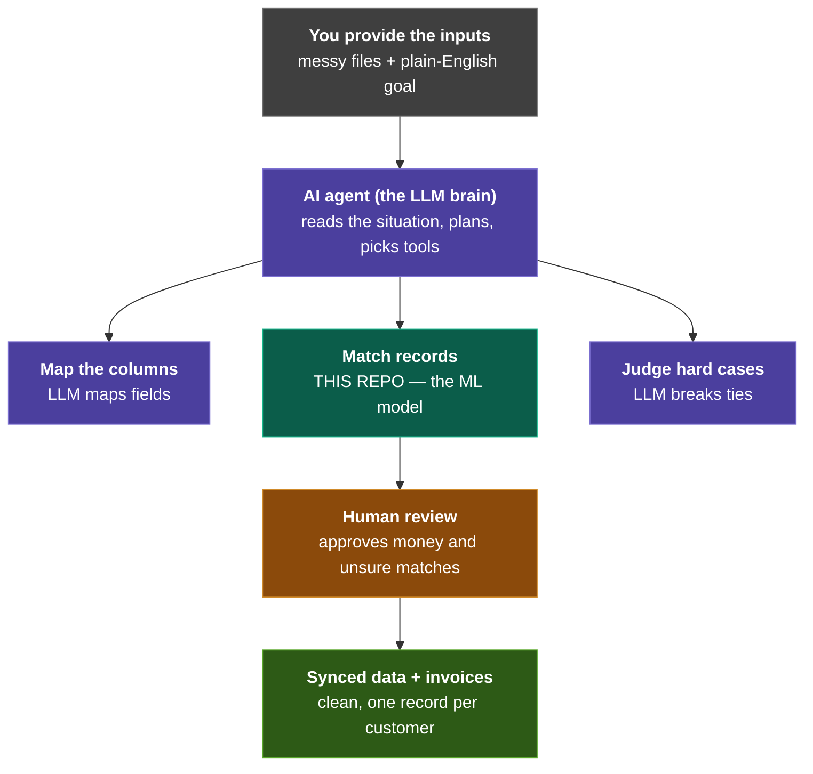

# Smart Customer Data Reconciliation Engine

**Machine learning that figures out when two messy database records are the same customer.**

Improved match quality from **F1 0.45 → 0.97** over a rules-based baseline, validated on a public
benchmark, with a hybrid LLM step for the cases the model finds genuinely ambiguous.

`Python` · `scikit-learn` · `pandas` · `rapidfuzz` · `Anthropic API`

---

## The problem, in one example

A small business keeps its customers in a spreadsheet *and* in a CRM. The same company shows up as:

| Excel | CRM |
|---|---|
| `Summit Construction Inc` | `SUMMIT  CONTRUCTION` |
| `(512) 555-0198` | `+15125550198` |
| `contact@summitco.com` | `contact@summitco.co` |

A human sees one customer. Software sees two — and creates a duplicate, then mails the same client
two invoices. Existing sync tools break here because they assume clean, consistent data.

Deciding *which records refer to the same real-world thing* is a well-studied ML problem called
**entity resolution** (or record linkage). It's harder than it looks: there's no shared ID to join
on, so the answer has to be **inferred** — and inference means uncertainty, which means a
confidence score and a human review step, not a yes/no.

---

## Results at a glance

| | Synthetic customers | Amazon-Google *(public benchmark)* |
|---|---|---|
| Records compared | 4,250 × 4,250 | 1,363 × 3,226 |
| **Rules baseline F1** | 0.45 | 0.41 |
| **This project (Random Forest)** | **0.97** | **0.61** |
| **+ LLM on uncertain pairs** | — | **0.64** |
| Comparisons avoided by blocking | 99.1% | 98.4% |
| True matches retained | 99.7% | 99.5% |

**Why the second column is lower — and why that's the honest number.** The first column is data I
generated, so I know every right answer and the records share a phone and email. The second is real
data where Amazon and Google describe the same product in completely different words with no shared
identifier. Published results for classical methods on this benchmark sit around **0.5–0.7**, so
0.61 lands where it should. *A portfolio project claiming 0.95 here has almost certainly leaked its
test set.*

---

## How it works

```
Two messy sources
     ↓
1. Normalize        strip punctuation, drop "Inc"/"LLC", phones → digits
     ↓
2. Block            compare only plausible pairs — 18.1M → 156K comparisons
     ↓
3. Features         fuzzy string-similarity scores per field (name, contact, email, phone)
     ↓
4. Classify         Random Forest weighs all features together → probability per pair
     ↓
5. Adjudicate       send only low-confidence pairs to an LLM
     ↓
One unified table, each row with a match confidence
```

**Step 2 is the one that matters most.** Comparing every record to every record is 18 million
comparisons and grows quadratically — double the data, quadruple the work. Blocking only compares
records sharing a cheap key, cutting that to 156,000.

The catch: **any true match that never becomes a candidate pair is lost permanently.** No model or
feature downstream can recover it. So "blocking recall" is a hard ceiling on the entire pipeline,
and it's the first number I check.

---

## Three things worth a closer look

### 1. A single blocking key is fragile — so I used three

Blocking on the first 3 letters of the company name fails whenever the typo lands *in those
letters*: `Dunmore` → `DDnmore` puts the two records in different buckets, gone forever. But those
same records often agree perfectly on a *different* field.

So candidates come from the **union of three cheap, exact keys** — a pair survives if *any* one
matches:

| Pass | Key | Rescues |
|---|---|---|
| 1 | first 3 chars of company name | the common case |
| 2 | exact phone number | name mangled, phone intact |
| 3 | email local part (before the `@`) | name mangled *and* domain wrong |

**Result: 97.1% → 99.7% recall, for 96 extra pairs out of 156,000** — a 0.06% cost. Pass 3 does most
of the work, because the data corrupts `.com` → `.co` but never touches the part before the `@`.

### 2. The method transferred to real data. The blocking key did not.

Running the same pipeline on the Amazon-Google benchmark, the feature engineering worked fine — but
the blocking key **collapsed from 97% recall to 46%**. Product titles don't put the distinguishing
word first (`canon powershot sd400` vs `canon 9160a001 powershot sd400 5mp digital camera`).

Switching to rare-token blocking fixed most of it. The stubborn remainder turned out to be
**disagreements about where words end** — `zonealarm` / `zone alarm`, `audition2` / `audition 2.0` —
which *no* word-based key can bridge. Blocking on character 5-grams of the whitespace-stripped title
sidesteps word boundaries entirely and reached 99.5%.

> **The transferable lesson: feature engineering ported across domains; blocking design did not.**

### 3. The LLM handles 2% of the pairs — because that 2% holds half the errors

Before writing a single API call, I measured whether the idea was worth building. The model's
mistakes are heavily concentrated in the pairs it scores near 0.5:

| Confidence band | % of all pairs | % of all model errors |
|---|---|---|
| 0.30 – 0.70 | **2.3%** | **52.5%** |

That asymmetry is the whole justification. Sending just that band to Claude:

| On the uncertain pairs only | Accuracy | Precision | Recall |
|---|---|---|---|
| Random Forest alone | 61.3% | 0.32 | 0.56 |
| **Claude adjudication** | **79.3%** | **0.54** | **0.92** |

Overall F1 **0.607 → 0.640**, for **$0.65 and 47 seconds**. Claude correctly separated
`Collector's Edition` from `Deluxe` of the *same* version, and two similarly-named kids' game
bundles containing different titles — distinctions no string-similarity score can represent.

**The matching itself stays deterministic on purpose.** You can't re-score 156,000 pairs with an
LLM on every sync and expect stable answers, acceptable latency, or an affordable bill. The cheap
model does the volume; the expensive one earns its cost only where the cheap one is unsure.

---

## How I checked I wasn't fooling myself

- **A baseline to beat.** 0.97 alone means nothing. 0.45 → 0.97 is a result.
- **F1, not accuracy.** Only ~2% of candidate pairs are real matches, so a model that answers "no
  match" every single time scores 98% accuracy and is completely useless.
- **A grouped train/test split.** A normal random split lets the *same product* appear in both
  training and test data, inflating the score. Splitting by product instead gave 0.607 vs 0.597 —
  close enough to confirm no leakage.
- **An oracle ceiling.** Before building the LLM step I computed what a *perfect* judge would score
  (0.668). Claude captured ~54% of that available gain. Knowing the ceiling first is how you decide
  whether an expensive feature is worth building at all.

---

## Honest limitations

- **The customer data is synthetic.** That's deliberate — measuring precision and recall requires
  knowing the right answers in advance, and real spreadsheets have no answer key. The benchmark
  section exists precisely because synthetic results alone don't prove generalisation.
- **Only 150 of 451 uncertain pairs were sent to the LLM** — a cost cap, not a limit of the method.
- **No threshold tuning.** Everything uses 0.5; tuning for F1 would likely add a point or two.
- **Structural mess isn't handled.** Merged cells, junk header rows, and dates-stored-as-text would
  all still break this. It solves *value-level* mess, which is the genuinely ML part.

---

## Run it

**Google Colab (easiest):** upload `reconciliation_engine.ipynb` → Runtime → Run all

**Locally:**
```bash
pip install -r requirements.txt
jupyter notebook reconciliation_engine.ipynb
```

A full run takes about a minute. Change `N_CUSTOMERS` at the top of the data-generation cell to
resize the dataset. The benchmark section downloads its own data (883 KB) on first run.

**Optional LLM section.** Everything else runs without it. To enable it, create a `.env` file
containing `ANTHROPIC_API_KEY=sk-ant-...` (gitignored). Without a key that section prints a notice
and skips — the notebook still runs end to end.

---

## Files

| File | What it is |
|---|---|
| `reconciliation_engine.ipynb` | The whole project — code, explanations, charts, results |
| `requirements.txt` | Dependencies (`anthropic` and `python-dotenv` are optional) |
| `excel_source.csv`, `crm_source.csv` | Generated messy inputs *(created on run)* |
| `unified_customers.csv` | The deduplicated output *(created on run)* |

---

---


## Where this fits: the bigger system (future work)

The matching engine in this repo is **one component** of a larger design for an automated
data-sync tool. The rest is planned, not built — but the architecture is deliberate, and the
reasoning behind it matters more than the code that would implement it.



**Legend —** 🟪 AI agent (LLM) · 🟩 the ML model in this repo · 🟫 human checkpoint


## Credits

Benchmark data: [Benchmark datasets for entity
resolution](https://dbs.uni-leipzig.de/research/projects/benchmark-datasets-for-entity-resolution),
Database Group, University of Leipzig.

Built as a data science portfolio project. The problem comes from a real market gap: small
businesses lack affordable tools that reliably sync customer data across spreadsheets, CRMs, and
invoicing systems without creating duplicates.
